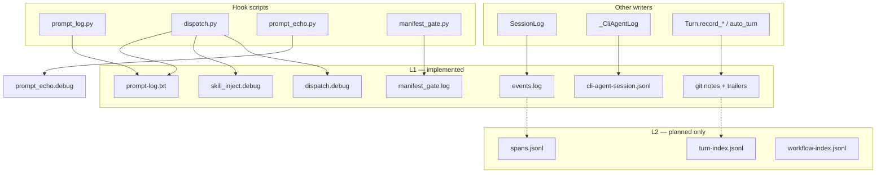

# CDD logging inventory

**Date:** 2026-09-06  
**Status:** research only — catalog of all logging across the repo as implemented today.  
**Related:** `.context/research/git-knowledge-and-workflow-backbone.md` (L1/L2 architecture, planned indexes)

---

## Executive summary

Logging in CDD is split across **seven layers**, each with different durability and purpose:

| Layer | Primary store | Durable? |
|-------|---------------|----------|
| Session expand/run audit | `events.log` (legacy dual-write to `open_turn.tool_calls` still in code) | Archived on session close |
| Cursor hook audit | `prompt-log.txt`, `*.debug` under session `logs/` | Archived on session close |
| Manifest gate hook | `utilities/manifest_hook/manifest_gate.log` | Gitignored at module path; **not** session-scoped |
| CLI agent orchestration | `cli-agent-session.jsonl` | Archived on session close |
| Agent BDD harness | `.context/.agent_bdd_sessions/logs/{scenario}/` | Ephemeral (manual delete) |
| Git eval / turns / chats | git notes + commit trailers | Git (durable) |
| Cursor IDE transcripts | `~/.cursor/projects/.../agent-transcripts/*.jsonl` | External; paths referenced in git |
| Planned L2 indexes | `turn-index.jsonl`, `spans.jsonl`, etc. | **Not implemented** |

**Removed / legacy:** `@log` decorator, `log_mistake` / `log_correction` host tools, `mistakes.log` file writer, `EvalSession` — eval is git-primary via `Turn.record_mistake` / `Turn.record_correction`.

---

## 1. Session action trail (expand / run audit)

**Purpose:** In-turn audit of `@agent_instructions` **expand** (framework) and **run** (explicit recipe calls). Mirrors to open turn for commit envelope. **Not** mistake/correction association.

| | |
|--|--|
| **Writers** | `SessionLog` (`utilities/workspace/session_log.py`); `Action._log_expansion`, `_walk_session_log_append` (`primitives/actions/action.py`); lifecycle actions (`generate`, `validate`, `satisfy`, `document`, `improvement`); `WorkSession.append_trail` (`utilities/workspace/workspace.py`) |
| **Path** | `{working_path}/.context/sessions/{name}/logs/events.log` |
| **Lifecycle** | Gitignored; **archived** to `{checkout}/.sessions/closed/{name}/logs/` on close |
| **Record shape** | `{ts} toolset=… name=… ok=… summary=… [role=expansion\|run] [error=…]` |

**Dual write paths (legacy — retire with consolidation):**

1. `SessionLog.append` → `events.log`
2. Same append mirrors into `WorkSession.open_turn.tool_calls` when set (`session_log._mirror_to_open_turn`)

Target design drops (2). Turn scope lives on each event as `turn_id`; commit envelope is built from filtered `operation` rows at `/turn` time, not from session-held turn state.

**Design principle** (from `workspace-eval-oo-sketch.md`): `events.log` = in-turn expand/run only; mistake↔correction association = **git notes + trailers**, not session files.

**Dead code:** `WorkSession._wipe_session_logs` exists but is never called — close uses `consolidate_logs_for_close` instead.

**Sources:** `utilities/workspace/session_log.py`, `session_log_spec.py`, `primitives/actions/action.py`, `.sessions/closed/eval-consolidate-workspace/workspace-eval-oo-sketch.md` §4

---

## 2. Cursor hooks layer (complete)

CDD has **two independent hook systems** wired through `.cursor/hooks.json`:

| System | Entry scripts | Module |
|--------|---------------|--------|
| **CDD hooks** | `primitives/hooks/dispatch.py`, `prompt_log/prompt_log.py`, `prompt_echo/prompt_echo.py` | `primitives/hooks/` |
| **Manifest gate** | `utilities/manifest_hook/manifest_gate.py` | `utilities/manifest_hook/` |

Harness deploy manages CDD `@hook` handlers; manifest gate is a separate optional fragment (`primitives/tools/hooks/manifest-gate.json`).

### 2.1 What is wired in `.cursor/hooks.json` today

Source: `.cursor/hooks.json` (live repo).

| Cursor event | Command | Logging output |
|--------------|---------|----------------|
| `preToolUse` | `prompt_log/prompt_log.py` | `prompt-log.txt` |
| `beforeSubmitPrompt` | `prompt_log/prompt_log.py` | `prompt-log.txt` |
| `beforeReadFile` | `prompt_log/prompt_log.py` | `prompt-log.txt` |
| `subagentStart` | `prompt_log/prompt_log.py` | `prompt-log.txt` |
| `afterAgentResponse` | `dispatch.py` | `dispatch.debug` + `prompt-log.txt` (via dispatch) + git commit when `auto_turn` enabled |

**Not wired in live `hooks.json` but implemented:**

| Script | Intended events | Logging | Notes |
|--------|-----------------|---------|-------|
| `dispatch.py` skill-inject branch | `preToolUse`, `preCompact` | `skill_inject.debug` | Runs only when `dispatch.py` is the hook command for those events — **currently blocked** because `preToolUse` is owned by `prompt_log.py` |
| `prompt_echo/prompt_echo.py` | `preToolUse` (when wired) | `prompt_echo.debug` + stderr | Default **off** — `.context/hooks/prompt_echo.disabled` exists |
| `manifest_gate.py` | `preToolUse`, `postToolUse`, `beforeReadFile`, `afterFileEdit` | `manifest_gate.log` | Fragment at `primitives/tools/hooks/manifest-gate.json` — **not merged** into live hooks.json |

### 2.2 Cursor events: three namespaces

**A — `CURSOR_EVENTS` in `hook.py`** (valid for `@hook` registration):

`sessionStart`, `beforeSubmitPrompt`, `afterAgentResponse`, `afterAgentThought`, `stop`, `sessionEnd`, `preCompact`, `preToolUse`, `postToolUse`, `postToolUseFailure`

**B — Cursor-only events used by mechanical scripts** (not in `CURSOR_EVENTS`):

`beforeReadFile`, `subagentStart`, `afterFileEdit` — wired in `prompt-log.json` / `manifest-gate.json` but cannot be `@hook` targets without extending `CURSOR_EVENTS`.

**C — Production `@hook` handlers registered today:**

| Handler | Owner | Event | Side effects logged |
|---------|-------|-------|---------------------|
| `Turn.auto_turn` | `utilities/workspace/workspace.py` | `afterAgentResponse` | git commit + `.context/hooks/turn/auto_turn.last_run.json` |

Toggle flag: `.context/hooks/turn/auto_turn_after_agent_response.enabled`

Harness emits on/off slash skills: `/auto_turn_after_agent_response_on|off`.

### 2.3 Mechanical scripts and their logs

Path resolution for CDD hooks: `hooks.session_logs.session_log_path(repo_root, filename)` → `.context/sessions/{active}/logs/{filename}`.

#### `prompt_log/prompt_log.py`

| | |
|--|--|
| **Purpose** | Read-only audit of what crosses the wire to the model |
| **Log file** | `.../logs/prompt-log.txt` |
| **Events handled** | `beforeSubmitPrompt`, `beforeReadFile`, `preToolUse`, `subagentStart`; also `afterAgentResponse` when called from `dispatch.py` |
| **Install** | `prompt_log/install_prompt_log.py` merges `prompt-log.json` into hooks.json |
| **Format** | Human-readable blocks: USER PROMPT, ATTACHMENTS, READ, tool I/O previews |

#### `dispatch.py` (multi-role entry point)

`main()` routing:

```
preToolUse / preCompact  →  skill-inject branch (_run_skill_inject_hook)
everything else          →  @hook dispatch (_run_dispatch_hook)
  afterAgentResponse     →  also appends prompt_log for agent response text
```

| Log / state | Path | Writer |
|-------------|------|--------|
| Dispatch debug | `.../logs/dispatch.debug` | `_dispatch_debug` — ENTRY, ENABLED, MERGED, handler results |
| Skill inject debug | `.../logs/skill_inject.debug` | `_skill_inject_log` — inject/skip/reset |
| Skill inject state | `.context/sessions/_skill_inject/{conversation_id}.json` | `mark_injected` — dedup per chat (not append log) |
| Auto-turn outcome | `.context/hooks/turn/auto_turn.last_run.json` | `Turn._record_auto_turn_run` — event, sha, skipped, error |
| OS notification | _(none)_ | `_skill_notify` / `_notify_test.ps1` — desktop balloon only |

**Legacy standalone:** `primitives/hooks/skill_inject.py` still exists and logs to **`primitives/hooks/skill_inject.debug`** (file-adjacent, not session-scoped). Superseded by inline skill-inject in `dispatch.py`.

#### `prompt_echo/prompt_echo.py`

| | |
|--|--|
| **Purpose** | Dev echo when action skill keywords detected in tool input |
| **Log file** | `.../logs/prompt_echo.debug` |
| **Also writes** | `stderr` line `{ts} [prompt-echo] tool=… action=…` |
| **Default** | **Off** when `.context/hooks/prompt_echo.disabled` exists (current repo state) |
| **Output to Cursor** | `user_message` when action detected |

#### `manifest_gate.py` (separate hook system)

| | |
|--|--|
| **Purpose** | Deliver governed-asset manifest guidance once per chat on file touch |
| **Log file** | `utilities/manifest_hook/manifest_gate.log` — `{ts} [{mode}] FIRED|skip {path}` |
| **State cache** | `utilities/manifest_hook/.manifest_gate_delivered.json` — conversation + toolset dedup |
| **Lifecycle** | Gitignored at module path; **not** moved by `consolidate_logs_for_close` |
| **Legacy retired** | `primitives/tools/hooks/.manifest_gate_clearance.json`, `primitives/tools/hooks/manifest_gate.debug` |

### 2.4 Hook infrastructure (non-append but hook-related)

| Artifact | Path | Role |
|----------|------|------|
| Active session pointer | `.context/sessions/_active` | Tells hook scripts which session owns `logs/` |
| Handler enable flags | `.context/hooks/{owner}/{operation}_{event_suffix}.enabled` | `@hook` handlers run only when flag exists |
| Prompt echo kill switch | `.context/hooks/prompt_echo.disabled` | Disables prompt_echo when present |
| Hook spec probe | `.context/hooks/turn/hook-spec-probe.txt` | BDD test artifact |
| Bootstrap | `primitives/hooks/bootstrap.py` | Imports `workspace.workspace` before dispatch |
| Deploy | `primitives/hooks/deploy.py`, `install_dispatch.py`, harness `deploy_dispatch()` | Syncs `dispatch.py` entries in hooks.json; emits toggle skills |

**`Hook(notify=True)`** — optional desktop notification via `_notify_test.ps1` per handler invocation (test harness only in specs).

### 2.5 Consolidation on session close

`consolidate_logs_for_close` (`primitives/hooks/session_logs.py`) runs before archive:

1. Move files from `default` session `logs/` into named session
2. Move legacy repo-root paths into session `logs/`:
   - `.context/prompt-log.txt`
   - `primitives/hooks/dispatch.debug`
   - `primitives/hooks/skill_inject.debug`
   - `primitives/hooks/prompt_echo.debug`
   - `primitives/hooks/prompt_echo/prompt_echo.debug`
3. Clear `.context/sessions/_active`

**Not consolidated:** `auto_turn.last_run.json`, `_skill_inject/*.json`, `manifest_gate.log`, `.manifest_gate_delivered.json`.

**Sources:** `primitives/hooks/session_logs.py`, `prompt_log/prompt_log.py`, `dispatch.py`, `prompt_echo/prompt_echo.py`, `utilities/manifest_hook/manifest_gate.py`, `primitives/hooks/.context/module-context.md`

---

## 3. CLI agent orchestration log

**Purpose:** Append-only timeline of CLI agent jobs, spawns, judge, human-check, errors.

| | |
|--|--|
| **Writer** | `_CliAgentLog` (`utilities/cli_agent/cli_agent.py`) |
| **Path** | `.context/sessions/{name}/cli-agent-session.jsonl` |
| **Lifecycle** | **Archived** with session folder (not wiped by `_CliScratch`) |

**Record kinds:** `header`, `session_start`, `spawn`, `jobs_defined`, `job_started`, `job_finished`, `human_check_needed`, `human_notified`, `human_check_resolved`, `judge_started`, `verdict`, `orchestrator_started/stopped`, `doer_finished`, `recovery`, `error`

**Related temps (wiped on `CliAgent.cleanup`):** `wait_judge*`, `judge-verdict*`, `cli-agent-job-queue.json`, `.context/cli-agent-doer.log`, etc.

**Sources:** `utilities/cli_agent/cli_agent.py`, `cli_agent_spec.py`, `.sessions/closed/cli-agent-fixes/issue-body.md`

---

## 4. Eval / mistakes / corrections (git-primary)

**Purpose:** Durable mistake→correction graph tied to introducing commit SHAs.

| | |
|--|--|
| **Writers** | `Turn.record_mistake`, `Turn.record_correction`; `Mistake.annotate`, `Correction.link` |
| **Storage** | Git notes (`refs/notes/eval-mistakes` default); correction commit message trailers |
| **Lifecycle** | **Git-durable** (survives session close) |

**Trailer keys on correction commits:** `Fixes-Mistake:`, `Introducing-Commit:`

**Legacy removed:** `log_mistake`, `log_correction`, `begin_eval_turn`, `finish_eval_turn`, `EvalSession`, `mistakes.log` writer — no live Python writer remains.

**Sources:** `utilities/workspace/workspace.py`, `utilities/git/git.py`, `utilities/git/.context/module-context.md`, `.cursor/skills/mistake/SKILL.md`, `.cursor/skills/correction/SKILL.md`

---

## 5. Agent BDD run logs

**Purpose:** Debug artifacts for live-agent mamba specs — prompts, shell captures, judge I/O.

| | |
|--|--|
| **Writers** | `AgentCliBlock`, `AgentChatBlock` |
| **Path** | `{module}/.context/.agent_bdd_sessions/logs/{scenario}/` |
| **Lifecycle** | **Ephemeral** — delete before session close if disposable |

**Artifact naming inside `logs/{scenario}/`:**

- `instruct-{NNN}-{setup|run}-prompt.txt`, `-response.txt`, `-stderr.txt`, `-timeout.txt`
- `instruct-{NNN}-shell-{NN}-cmd.txt`, `-out.txt`
- `instruct-{NNN}-stdin.yaml`, `-cli-output.yaml`, `-ai-response.yaml`
- `judge-prompt.txt`, `judge-rubric.txt`, `judge-output.txt`, `judge-verdict.txt`, etc.

**Legacy path:** `primitives/tools/.sessions/logs/` (pre-`.context` layout — stale artifacts may remain).

**Sources:** `context_tools/agent_bdd/agent_cli_bdd.py`, `agent_chat_bdd.py`, `agent_bdd.md`

---

## 6. Chat / transcript association (git pointers)

**Purpose:** Link work session to Cursor/CLI chat transcript **paths** on close commit — not copies of transcript content.

| | |
|--|--|
| **Writer** | `WorkSession.save_chat` |
| **Storage** | Git note `refs/notes/chats` + tag `chat/session/{branch}` |
| **Source paths** | `CURSOR_CONVERSATION_ID` → `cursor_chat_file`; CLI doer/judge ids when bound |

Transcript files live at `~/.cursor/projects/{workspace-slug}/agent-transcripts/{chat_id}/{chat_id}.jsonl`.

**Sources:** `utilities/workspace/workspace.py`, `workspace_session.md`

---

## 7. Decision records (CDR — not session logging)

**Purpose:** Numbered decision markdown under durable `.context/cdr/`.

| | |
|--|--|
| **Writer** | `record_decisions.write_cdr` |
| **Path** | `{root}/.context/cdr/NNNN-slug.md` |
| **Lifecycle** | Durable artifact (not session temp) |

---

## 8. Git-based logging (audit backbone)

| Mechanism | Used for |
|-----------|----------|
| **Commit subject + body** | Turn identity, human-readable summary |
| **Commit trailers** | `Context-Tool:`, `Action:`, `Utility:`, `Subject:`; correction `Fixes-Mistake:`, `Introducing-Commit:` |
| **`refs/notes/cdd-turns`** | Turn envelope on commit SHA |
| **`refs/notes/chats`** | Chat transcript path on close commit |
| **`refs/notes/eval-mistakes`** | Mistake payload on introducing SHA |
| **Annotated tags** | `chat/session/{branch}` lists transcript paths |
| **`events.log` excluded from dirty** | `GitRepo._is_runtime_log` — logging doesn't block worktree removal |

**Planned L2 layer** (documented, not implemented): `turn-index.jsonl`, `workflow-index.jsonl`, `spans.jsonl` / `SpanLog` — see git-knowledge backbone §2, G-11, G-32.

**Source:** `.context/research/git-knowledge-and-workflow-backbone.md`

---

## 9. Session close: deleted vs archived

**Actual `WorkSession.close()` sequence** (`utilities/workspace/workspace.py`):

1. Finish open turn (commit if dirty)
2. `cli_agent.cleanup()` — wipe CLI scratch files only
3. Rewrite `session.md` with End block
4. **`_consolidate_session_for_archive()`** — move hook logs into session `logs/`, clear `_active`
5. Commit if dirty; **`save_chat`** for running chats
6. **`_archive_session_folder()`** — move entire `.context/sessions/{name}/` → `.sessions/closed/{name}/`
7. Git-commit closed archive; land branch; remove worktree if clean

| Artifact | On close |
|----------|----------|
| `logs/*` (events, prompt-log, `*.debug`) | **Archived** |
| `cli-agent-session.jsonl` | **Archived** |
| `session.md`, `model` | **Archived** |
| CLI scratch (`wait_judge*`, job queue, etc.) | **Deleted** before archive |
| `.context/sessions/{name}/` active path | **Removed** (moved) |
| Durable `.context/` artifacts (sketches, generate) | **Untouched** |
| Agent BDD logs under module `.context/` | **Not auto-deleted** |
| `auto_turn.last_run.json` | **Stays** in `.context/hooks/turn/` |
| `_skill_inject/*.json` | **Stays** in `.context/sessions/_skill_inject/` |
| `manifest_gate.log` | **Stays** at `utilities/manifest_hook/` |
| Git notes / commits | **Persist** |

---

## 10. Legacy vs current paths

| Concept | Legacy | Current |
|---------|--------|---------|
| Prompt audit | `.context/prompt-log.txt` | `.context/sessions/{name}/logs/prompt-log.txt` |
| Dispatch debug | `primitives/hooks/dispatch.debug` | session `logs/dispatch.debug` |
| Active session pointer | implicit / repo-root logs | `.context/sessions/_active` |
| Eval mistakes | `mistakes.log` in session folder | git notes on introducing SHA |
| Eval API | `log_mistake`, `host.eval`, `EvalSession` | `Turn.record_mistake/correction` |
| Run logging | `@log` decorator | explicit `SessionLog.append` |
| Agent BDD logs | `primitives/tools/.sessions/logs/` | `{module}/.context/.agent_bdd_sessions/logs/` |
| Skill inject debug | `primitives/hooks/skill_inject.py` adjacent `.debug` | session `logs/skill_inject.debug` via `dispatch.py` |
| Manifest gate log | `primitives/tools/hooks/manifest_gate.debug` | `utilities/manifest_hook/manifest_gate.log` |
| L2 indexes | N/A (never built) | Designed: `turn-index.jsonl`, `spans.jsonl` |

---

## 11. Decorators and annotations

| Annotation | Role | Status |
|------------|------|--------|
| `@hook` / `Hook(...)` | Register Cursor hook handlers | **Current** |
| `@agent_tool` on `Turn.record_mistake/correction` | Agent-facing eval tools | **Current** |
| `@agent_instructions` + explicit `SessionLog.append` | Run audit in recipe bodies | **Current** |
| `@log` | Auto-log tool/action runs | **Removed** |
| `is_logged`, `member_is_logged`, `apply_log_control` | Runner decorator logging | **Removed** |

Logging is **not** an `@agent_tool` — `SessionLog.append` is a plain call, not agent-visible.

---

## 12. Gaps and doc/code mismatches

1. **`utilities/workspace/.context/module-context.md` § Close** says "`logs/` — deleted (`cleanup`)" — **code archives logs** via `_consolidate_session_for_archive`.
2. **`primitives/hooks/.context/module-context.md`** documents `.context/prompt-log.txt`, `primitives/hooks/dispatch.debug`, and standalone `skill_inject.py` — **runtime uses session-scoped `logs/`** and skill-inject lives **inside `dispatch.py`**.
3. **Skill inject unreachable:** `dispatch.py` skill-inject branch requires `dispatch.py` as the hook command for `preToolUse`/`preCompact`, but live `hooks.json` assigns `preToolUse` to `prompt_log.py` only — **`skill_inject.debug` never writes in normal use**.
4. **Manifest gate not merged:** `manifest-gate.json` fragment exists but is absent from live `.cursor/hooks.json` — **`manifest_gate.log` only writes when manually wired**.
5. **`CURSOR_EVENTS` incomplete:** `beforeReadFile`, `subagentStart`, `afterFileEdit` are valid Cursor events but cannot be `@hook` targets without extending `hook.py`.
6. **`_wipe_session_logs`:** defined, never invoked.
7. **`SessionLog._maybe_write_payloads`:** companion `event-*-request/response.yaml` files not written despite helper existing.
8. **Dual trail writers:** `SessionLog.append` and `WorkSession.append_trail` — same shape, two entry points.
9. **`catalog/actions.html`:** still describes `@log`, `eval.Session`, `log_mistake`.
10. **`instructions._FRAMEWORK_ACTIONS`:** still lists `log_mistake`, `log_correction`.
11. **Planned L2 layer:** zero Python implementation for `turn-index.jsonl`, `spans.jsonl`.
12. **`improvements.log`:** referenced in old repair flows — **not present** in repo code.
13. **`.gitignore`** still lists legacy root-level hook log paths; manifest gate log path in gitignore points to old `primitives/tools/hooks/` location.
14. **Legacy `skill_inject.py`:** duplicate implementation with file-adjacent logging — confusing alongside inline dispatch version.

---

## 13. Key source file index

| Area | Files |
|------|-------|
| Session log core | `utilities/workspace/session_log.py`, `session_log_spec.py` |
| Workspace lifecycle | `utilities/workspace/workspace.py`, `workspace_session_spec.py`, `workspace_session.md` |
| Hook paths | `primitives/hooks/session_logs.py` |
| Hook registry / deploy | `primitives/hooks/hook.py`, `bootstrap.py`, `deploy.py`, `install_dispatch.py` |
| Hook writers | `primitives/hooks/prompt_log/prompt_log.py`, `dispatch.py`, `prompt_echo/prompt_echo.py` |
| Hook legacy | `primitives/hooks/skill_inject.py` (superseded) |
| Manifest gate | `utilities/manifest_hook/manifest_gate.py`, `manifest_gate_conf.py`, `primitives/tools/hooks/manifest-gate.json` |
| Hook wiring | `.cursor/hooks.json`, `prompt_log/prompt-log.json` |
| Action expand/run | `primitives/actions/action.py` |
| CLI agent | `utilities/cli_agent/cli_agent.py`, `cli_agent_spec.py` |
| Agent BDD | `context_tools/agent_bdd/agent_cli_bdd.py`, `agent_chat_bdd.py` |
| Git audit | `utilities/git/git.py` |
| Design / research | `.context/research/git-knowledge-and-workflow-backbone.md`, `.sessions/closed/eval-consolidate-workspace/workspace-eval-oo-sketch.md` |
| Example probe | `primitives/tools/examples/logged_probe/logged_probe.py` |

---

## 14. Architecture diagram (current vs planned)



**Highest leverage next** (per git-knowledge backbone): G-06 context-package + G-32 turn-index (Phase 1).

---

## 16. Proposed consolidation (design only)

Not implemented. CLI agent out of scope (§3).

### Session folder — two yaml files

Session folder is the envelope. No `session` field on rows. **No payload spill files** — rows stay brief: paths, file names, variable names.

```
.context/sessions/{name}/
  session.yaml    # session details + turns[] with operations[]
  prompt.yaml     # what injected prompts into the agent
```

### `session.yaml`

One file. Top = session details; **`turns[]`** = one block per commit (`id` = commit sha); each turn has **`operations[]`**.

**Session header**

- `session`, `branch`, `contexts`, `path`, `started`
- on close: `ended`, `outcome`, `handoff` (same as `session.md` End block)

**Each turn**

- `id` — commit sha (`TurnCommit.sha`)
- `operations[]` — what ran during that turn

**Each operation**

- `source` — `hook` | `agentic tool call` | `direct invoke`
- `signature` — e.g. `Turn.auto_turn(afterAgentResponse)`, `toolset.action`, `toolset.tool`
- `input` — brief: event name, hook name, param names/values, paths — not file contents
- `output` — `ok`, `summary`, `error`, `duration_ms`

Example:

```yaml
session: utility-cleanup
branch: session/utility-cleanup
contexts: [workspace]
path: C:\dev\abd-cdd-utility-cleanup
started: 2026-09-06T14:00
turns:
  - id: abcdef1
    operations:
      - source: hook
        signature: Turn.auto_turn(afterAgentResponse)
        input:
          event: afterAgentResponse
          hook: auto_turn
        output:
          ok: true
          summary: committed abcdef1
          duration_ms: 842
      - source: agentic tool call
        signature: context_tools.actions.improvement.generate
        input:
          action: generate
        output:
          ok: true
          summary: tools=document,validate
      - source: direct invoke
        signature: tools.examples.logged_probe.ping
        input:
          message: hi
        output:
          ok: true
          summary: pong
```

### When / what → `operations[]`

- **`source: hook`** — dispatch runs registered `@hook` handler → **always** logged in `operations[]` (not optional)
- **`source: agentic tool call`** — `@agent_instructions` expand or agent runs a recipe tool
- **`source: direct invoke`** — explicit `SessionLog.append` / `tools run` in recipe body
- **New turn block** — `/turn` or `auto_turn` commits → append `turns[]` entry, `id` = sha
- **Retired:** `open_turn.tool_calls`, separate `events.log`, payload sidecars

### `prompt.yaml`

Replaces `prompt-log.txt`, `skill_inject.debug`, `dispatch.debug`. Vocabulary from **`prompt_log.py`** + **`dispatch.py`**.

**Two different things:**

- **Registered `@hook` handlers** → always logged in **`session.yaml`** `operations[]` (`source: hook`) — see above
- **Every hook logging** → optional audit of **all** Cursor hook events (`beforeSubmitPrompt`, `preToolUse`, `beforeReadFile`, `subagentStart`, …) — what `prompt_log.py` does today — **off by default**; turn on to debug wiring

**Every hook logging off (default)** — no `prompt.yaml` rows for hook audit (registered hooks still in `session.yaml`)

**Every hook logging on** — one row per Cursor hook event: **what the hook received** (event, payload, previews, dispatch merge when applicable) — **same whether prompt is from an annotated attachment or built dynamically at runtime**

Example (every hook logging on):

```yaml
prompts:
  - event: beforeSubmitPrompt
    conversation_id: conv_abc123
    kind: rule
    path: .cursor/rules/committing-changes-with-git.mdc
    user_prompt: |
      consolidate session logging into session.yaml
  - event: preToolUse
    kind: skill
    path: .cursor/skills/context_tools/cdd/SKILL.md
    tool_name: Bash
    preview: |
      command: npm test
  - event: preToolUse
    kind: custom_tool
    name: manifest_gate
    prompt: |
      (built at runtime — same row shape, hook logs what it received)
  - event: afterAgentResponse
    preview: |
      Updated §16...
    dispatch:
      enabled: [Turn.auto_turn]
      merged:
        permission: allow
```

### Hook path

```
Cursor → dispatch → registered @hook handler → session.yaml operations[] (always)
                 → prompt_log (if every hook logging on) → prompt.yaml
```

### Legacy → target

- `session.md` → `session.yaml` header + close fields
- `events.log` → `turns[].operations[]`
- `open_turn.tool_calls` → drop
- `@hook` handlers → `operations[]`, `source: hook`
- `Turn.turn` / git commit → `turns[]` entry, `id` = sha
- `prompt-log.txt` → `prompt.yaml`
- `dispatch.debug`, `manifest_gate.log`, payload sidecars → drop
