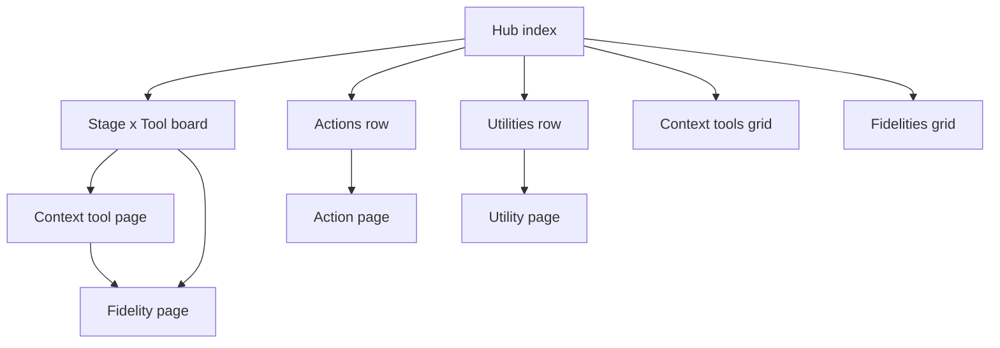

# CDD Catalog (Foundry for Context Tools)

**Sketch:** `[cdd-catalog-sketch.md](./cdd-catalog-sketch.md)` — `/stories sketch` story map for this plan's build order: 5 epics (Align Code With Catalog Names → Assemble Catalog Page Data → Render Self-Contained Catalog Pages → Make Catalog Output Portable → Configure And Migrate Illustrated Examples), one main-flow scenario per story, no variations or example data. Deepen there before turning any story into real code.

## Mapping from abd-skills


| abd-skills Foundry                                 | CDD catalog                                                                   |
| -------------------------------------------------- | ----------------------------------------------------------------------------- |
| Practice / plugin                                  | Context tool (`stories`, `ddd`, `ux`, `clean_engineering`, `bdd`) — display as **Stories · Domain-Driven Design · User Experience · Clean Engineering · Behavior-Driven Development** |
| Skill                                              | Fidelity (`story_map`, `behavior`, `tactics`, …)                                 |
| Stage columns (kanban)                             | CDD stages: **discovery → spec → engineer** — also `[cdd.py](c:\dev\abd-works-repo\abd-context-driven-delivery\context_tools\cdd\cdd.py)`'s own `fidelities` dict (`discovery→"discovery"`, `spec→"spec"`, `engineer→"engineer"`), so CDD is a **header-styled but clickable top row**, not decorative chrome |
| Supporting row                                     | **Actions** — public `@action` methods under `# -- Lifecycle actions` on `[BaseContextTool](c:\dev\abd-works-repo\abd-context-driven-delivery\context_tools\base\base_context_tool.py)`, source order |
| Foundations row                                    | **Utilities** — `deploy_agent_skills` · `diagnose` · `handoff` · `workspace` · `sub_agent` |
| Prompts / instructions / agents / output map / npx | **Omit**                                                                      |


Source of truth is code + guides in this repo (not hand-maintained stage markdown tables). Prefer each tool’s `fidelities` ClassVar over stale prose in `[cdd.md](c:\dev\abd-works-repo\abd-context-driven-delivery\context_tools\cdd\cdd.md)`.

## Information architecture




**Hub board (primary navigation)**  

- **Top row — CDD, styled as the header:** cells read `discovery` / `spec` / `engineer`, identical to the column labels, because `Cdd.fidelities` maps each stage to itself. Visually this reads as the board's header strip, but it is a **real row** — each cell is clickable to that CDD fidelity page (which embeds the same board with that column highlighted and lists the child tools active at that stage). Do not render it as inert `<th>` chrome; it is card-shaped like every other row, just top-pinned and header-toned.
- Context-tool rows (long display names, never abbreviations): Stories · Domain-Driven Design · User Experience · Clean Engineering · Behavior-Driven Development  
- Columns: discovery · spec · engineer  
- Tickets (one fidelity per cell — from each tool’s `fidelities` ClassVar; blank = not on that CDD stage):

| Context tool | discovery | spec | engineer |
|---|---|---|---|
| **CDD** *(header row)* | `discovery` | `spec` | `engineer` |
| Stories | `story_map` | `scenarios` | `acceptance_tests` |
| Domain-Driven Design | `bounded_context` | `building_blocks` | `tactics` *(was `code`)* |
| User Experience | `ia` | `mockup` | `front_end_code` *(was `code`)* |
| Clean Engineering | `modules` | `model` | `code` |
| Behavior-Driven Development | — | `behavior` | `development` |

Sources: `[cdd.py](c:\dev\abd-works-repo\abd-context-driven-delivery\context_tools\cdd\cdd.py)`, `[stories.py](c:\dev\abd-works-repo\abd-context-driven-delivery\context_tools\stories\stories.py)`, `[ddd.py](c:\dev\abd-works-repo\abd-context-driven-delivery\context_tools\ddd\ddd.py)`, `[ux.py](c:\dev\abd-works-repo\abd-context-driven-delivery\context_tools\ux\ux.py)`, `[clean_engineering.py](c:\dev\abd-works-repo\abd-context-driven-delivery\context_tools\clean_engineering\clean_engineering.py)`, `[bdd.py](c:\dev\abd-works-repo\abd-context-driven-delivery\context_tools\bdd\bdd.py)`. BDD has ClassVar `DISCOVERY → modules` but CDD’s discovery stage omits Bdd (`[cdd.py](c:\dev\abd-works-repo\abd-context-driven-delivery\context_tools\cdd\cdd.py)` `_CONTEXT_TOOLS_BY_STAGE`) — hub cell stays empty.

**Naming notes**

- UX engineer: display **Front-end code**; fidelity key `front_end_code` (replacing bare `code`).
- DDD engineer: display **Tactics**; fidelity key `tactics` (replacing bare `code`) — implementing the building blocks from spec (entities, VOs, aggregates, domain services).

**Rule — catalog names = code names.** Any rename decided here is applied in the repo, not as a catalog display alias. Touch: ClassVars / format defaults, `##` headings, specs, skill shims / manifests, folder / module / class names, and any other string references. Do this **before or with** catalog generation so the scraper reads the real keys.

### Actions row (under the board)

Source: `[base_context_tool.py](c:\dev\abd-works-repo\abd-context-driven-delivery\context_tools\base\base_context_tool.py)` section `# -- Lifecycle actions`. Emit one card per public `@action`, **in source order**. Ignore private methods (`_…`). Ignore `@tool` methods (`scan`, `log_mistake`, `log_correction`, session tools, etc.).

**Every action page has the same four sections, in this fixed order — structure never varies action to action, only content does:**

1. **Tools / actions called** — bulleted list, each item a hyperlink to that other action's page (or plain text + "(tool, no page)" for `@tool` calls with no catalog page). Empty list renders as "Calls nothing else directly."
2. **Markdown instructions** — the `{name}.md` guide body for the resolved source dir, fenced ` ```markdown `. If none exists, section shows "No dedicated guide — see module overview below."
3. **Module overview** — the `.context/module-context.md` Purpose/Seam prose for the resolved source dir, fenced ` ```markdown `.
4. **Code** — **main file only** (`{dirname}.py`; for base-hosted actions this is `base_context_tool.py` — do not also list peer files like `partition_index.py` / `segment.py`), fenced ` ```python `.

All four are collapsible/expandable `<details>`, open by default for (1) and closed by default for (2)–(4) since those are longer.

| # | Action | Resolved source dir | 1. Calls | 2. Markdown guide | 3. Module overview | 4. Code (main file) |
|---|---|---|---|---|---|---|
| 1 | `partition` | `utilities/partition/` | none | ✅ `[partition.md](c:\dev\abd-works-repo\abd-context-driven-delivery\utilities\partition\partition.md)` | ✅ `[module-context.md](c:\dev\abd-works-repo\abd-context-driven-delivery\utilities\partition\.context\module-context.md)` | ✅ `[partition.py](c:\dev\abd-works-repo\abd-context-driven-delivery\utilities\partition\partition.py)` |
| 2 | `grill` | `utilities/grill_context/` | → `generate` | ❌ none | ✅ `[module-context.md](c:\dev\abd-works-repo\abd-context-driven-delivery\utilities\grill_context\.context\module-context.md)` | ✅ `[grill_context.py](c:\dev\abd-works-repo\abd-context-driven-delivery\utilities\grill_context\grill_context.py)` |
| 3 | `sketch` | `utilities/sketch/` | → `generate` | ✅ `[sketch.md](c:\dev\abd-works-repo\abd-context-driven-delivery\utilities\sketch\sketch.md)` | ✅ `[module-context.md](c:\dev\abd-works-repo\abd-context-driven-delivery\utilities\sketch\.context\module-context.md)` | ✅ `[sketch.py](c:\dev\abd-works-repo\abd-context-driven-delivery\utilities\sketch\sketch.py)` |
| 4 | `generate` | `context_tools/base/` | none | ✅ `[base_context_tool.md](c:\dev\abd-works-repo\abd-context-driven-delivery\context_tools\base\base_context_tool.md)` | ✅ `[module-context.md](c:\dev\abd-works-repo\abd-context-driven-delivery\context_tools\base\.context\module-context.md)` | ✅ `[base_context_tool.py](c:\dev\abd-works-repo\abd-context-driven-delivery\context_tools\base\base_context_tool.py)` |
| 5 | `document` | `context_tools/base/` | none (calls `scanner.scan`, tool) | ✅ same as `generate` | ✅ same as `generate` | ✅ same as `generate` |
| 6 | `iterate` | `utilities/iterate/` | → `generate` | ❌ none | ✅ `[module-context.md](c:\dev\abd-works-repo\abd-context-driven-delivery\utilities\iterate\.context\module-context.md)` | ✅ `[iterate.py](c:\dev\abd-works-repo\abd-context-driven-delivery\utilities\iterate\iterate.py)` |
| 7 | `validate` | `context_tools/base/` | none (calls `scanner.scan`, tool) | ✅ same as `generate` | ✅ same as `generate` | ✅ same as `generate` |
| 8 | `satisfy` | `context_tools/base/` | none | ✅ same as `generate` | ✅ same as `generate` | ✅ same as `generate` |
| 9 | `repair` | `utilities/repair/` | none (calls `self.scan()`, tool) | ✅ `[repair.md](c:\dev\abd-works-repo\abd-context-driven-delivery\utilities\repair\repair.md)` | ✅ `[module-context.md](c:\dev\abd-works-repo\abd-context-driven-delivery\utilities\repair\.context\module-context.md)` | ✅ `[repair.py](c:\dev\abd-works-repo\abd-context-driven-delivery\utilities\repair\repair.py)` |
| 10 | `improve` | `utilities/repair/` | none (calls `self.repairer.improve()`) | ✅ `[improve.md](c:\dev\abd-works-repo\abd-context-driven-delivery\utilities\repair\improve.md)` | ✅ same as `repair` | ✅ same as `repair` |

Skipped (override hooks, not top-level lifecycle actions): `generate_output`, `add_generate_header_to_generated`, `generate_fixes_from_validate`.

Generator resolves the source dir by walking the `@action` body (delegate call → peer kit dir under `utilities/{name}/`) or, for actions with no delegate call (`generate`, `document`, `validate`, `satisfy`), falls back to `context_tools/base/`. Same walk collects same-instance `self.<other_public_action>()` calls for section 1, and probes the two fixed filenames (`{action}.md` preferred over `{dirname}.md` when both exist — so `improve` gets `improve.md` while sharing `utilities/repair/` with `repair`), plus `.context/module-context.md` and the single main `{dirname}.py` for sections 2–4. `@tool` calls (`scan`, `log_mistake`, `log_correction`, session tools) go in section 1 as plain text — they are not hyperlinked because there is no catalog page for them, not omitted from the list.

### Utilities row (under Actions)

True utilities — not lifecycle actions. Catalog cards; two renames land in code:

| Catalog / code name | Today | Notes |
|---|---|---|
| `deploy_agent_skills` | `agent_skills` | rename folder, module, classes, skills |
| `diagnose` | `diagnose` | keep |
| `handoff` | `handoff` | keep |
| `workspace` | `sessions` | **done.** Top-level package folder only — `utilities/sessions/` → `utilities/workspace/`. Every file name (`session.py`, `session_log.py`, `workspace_session.py`, `context_index.py`, their `*_spec.py`s) and class name (`Session`, `SessionLog`, `SessionPaths`, `ContextIndex`, `WorkspaceSession`) is unchanged — only the import prefix moved from `sessions.X` to `workspace.X`. |
| `sub_agent` | `sub_agent` | **not renamed.** `sub_agent` is a decorator mechanism (`@sub_agent`, `SubAgentTool` dataclass, `discover_sub_agent_tools`, a `"kind": "sub_agent"` manifest key, registered into `primitives/actions/action.py`'s tool discovery) — not a toolset with callable tools like the other four rows. Catalog shows it under its real name; no code change. |

`base` is **not** out of scope — its lifecycle `@action`s are the entire Actions row (§ above), and four of those ten action pages (`generate`, `document`, `validate`, `satisfy`) resolve straight to `context_tools/base/` for guide, overview, and code. There is simply no separate **context-tool row** for `base` (it's not a stage×tool cell) — it shows up as Actions, not as a sixth Stories/DDD/UX/… row.

**Out of scope for v1 pages:** `create_context_tool`, `agent_bdd`, scanners as their own catalog row (scan stays a `@tool`, not an Actions card), echo / record_decisions unless later pulled into lifecycle. (`cdd` is **in scope** — it's the header row, per above, not omitted.)

## Page shapes (close to Foundry, CDD-adjusted)

**Hub** `[catalog/index.html](c:\dev\abd-works-repo\abd-skills\catalog\index.html)` analogue  

- Hero + short CDD lead  
- Embedded stage×tool board  
- **Actions** row  
- **Utilities** row  
- Links to tools grid + fidelities grid (+ optional actions/utilities grids)

**Context tool page** (≈ plugin page)  

- Badge: Context tool  
- Description from `[module-context.md](c:\dev\abd-works-repo\abd-context-driven-delivery\context_tools\stories\.context\module-context.md)` Purpose / Overview  
- Contents: **Fidelities** only (cards → fidelity pages) — no Agents/Prompts/Instructions/Lib slots  
- Shared surface note: lifecycle **Actions** hosted via `[BaseContextTool](c:\dev\abd-works-repo\abd-context-driven-delivery\context_tools\base\base_context_tool.py)`
- **CDD's own tool page** works the same way (badge: Context tool), except its three fidelities are named `discovery` / `spec` / `engineer` and its Purpose comes from `[cdd module-context.md](c:\dev\abd-works-repo\abd-context-driven-delivery\context_tools\cdd\.context\module-context.md)`. This page is what the header row's cells link to.

**Fidelity page** (≈ skill page)  

- **Section 0 — Quick invoke (chat command).** First thing on the page, above the hero. Every context tool deploys as a Cursor skill named after itself (`[stories/SKILL.md](c:\dev\abd-works-repo\abd-context-driven-delivery\.cursor\skills\stories\SKILL.md)` → `/stories`, and likewise `/ddd`, `/ux`, `/bdd`, `/cdd`; note **Clean Engineering's skill folder is hyphenated** → `[clean-engineering/SKILL.md](c:\dev\abd-works-repo\abd-context-driven-delivery\.cursor\skills\clean-engineering\SKILL.md)` → `/clean-engineering`, not `/clean_engineering`). Show the template for *this page's own fidelity*:

  ```
  /{skill} <action> {fidelity}
  ```

  e.g. on the Stories `story_map` page: `/stories <action> story_map`. Below the template, a bulleted list of the 10 lifecycle actions as the legal values for `<action>` — same set, same order as the Actions row — each a hyperlink to that action's own page, one-liner lifted from the action's own docstring where one already exists (`grill`/`sketch`/`iterate` have good ones; write a plain one for the rest, don't invent flowery copy):

  - **[partition](…/actions/partition.html)** — carve a large context into indexed chunks before generating
  - **[grill](…/actions/grill.html)** — grill loop on open decisions, then run generate
  - **[sketch](…/actions/sketch.html)** — grill + sketch cadence, then run generate
  - **[generate](…/actions/generate.html)** — produce the artifact at this fidelity
  - **[document](…/actions/document.html)** — describe existing state; scanner flags violations, none corrected
  - **[iterate](…/actions/iterate.html)** — grill + formal generate/validate/one-fix ticks
  - **[validate](…/actions/validate.html)** — scan existing artifacts and report violations
  - **[satisfy](…/actions/satisfy.html)** — confirm readiness before validate; no artifact changes
  - **[repair](…/actions/repair.html)** — fix one flagged violation in an existing asset
  - **[improve](…/actions/improve.html)** — full mistake→correction→repair→regression loop (more important than one-shot repair)

  This is a documented **usage convention for the human/agent typing in chat**, not a claim that Cursor's `/` parser natively tokenizes positional args — the skill still loads its manifest/instructions as today; this line just tells the reader the shorthand phrase to type and which action they're asking for.

- Hero: fidelity name + owning tool + stage  
- Same board embed with that ticket highlighted  
- **No separate YAML block here.** Section 0's `/{skill} <action> {fidelity}` line is the one and only prominent command on the page — a second, competing "Invoke" block showing raw `toolset`/`context`/`action` YAML would just confuse readers about which one is real. Instead, Section 0 ends with one small subsidiary link — "Raw manifest format →" — to the same YAML request shape every deployed `SKILL.md` already documents (`toolset: / context: / action: / arguments:`). Linked, never inlined, never given equal billing.
- **Guidance** from matching `## {fidelity}` section in `{tool}.md` (e.g. `[bdd.md](c:\dev\abd-works-repo\abd-context-driven-delivery\context_tools\bdd\bdd.md)` `## behavior`) rendered as expandable details when the section has subsections; otherwise a single prose body  
- Default format from `_fidelity_format_defaults` when present  
- Skip Concepts/Rules split unless the MD already has that structure; scrape fidelity H2 body as-is
- **Illustrated example** — a fifth panel, collapsible, sourced from that tool's explicit config (never inferred/guessed). Fenced ` ```markdown ` / ` ```python ` / ` ```typescript ` to match the source. Shows "No illustrated example configured yet" when the config has no row for that fidelity.

**Action page** — fixed four-section shape (structure identical across every action; content varies)  

- Hero: action name + “Lifecycle action” badge + a plain one-line "used as `action: {name}` in the request" note + the same small "Raw manifest format →" subsidiary link — no inline YAML block competing with the badge
- **① Tools / actions called** — bulleted list, hyperlinks to each other action's page (plain text + "(tool, no page)" for `@tool` calls like `scan`); "Calls nothing else directly" when empty
- **② Markdown instructions** — the resolved `{name}.md` guide, fenced ` ```markdown `; "No dedicated guide — see module overview below" when none
- **③ Module overview** — the resolved `.context/module-context.md` Purpose/Seam prose, fenced ` ```markdown `
- **④ Code** — the resolved **main file only** (`{dirname}.py`), fenced ` ```python `

**Utility page**  

- Purpose + seam from `[utilities/*/ .context/module-context.md](c:\dev\abd-works-repo\abd-context-driven-delivery\utilities\diagnose\.context\module-context.md)`  
- Link to `{utility}.md` guide when present  
- Not stage tickets; not listed on the Actions row unless also a lifecycle `@action`

**Flat grids:** `context-tools.html`, `fidelities.html`, `actions.html`, `utilities.html` — same card chrome as Foundry skills/plugins grids.

## Illustrated examples (per fidelity)

Each Fidelity page gets one **Illustrated example** panel (see Fidelity page shape above). Which file/section is "the" illustration is an **explicit config, not a heuristic** — generator reads a small table, it does not scan folders and guess the best-looking file.

**Config location:** a `## Illustrated examples` table added to the top of each tool's existing example index — `context_tools/{tool}/examples/examples.md` (all tools already have one except UX, which uses `examples/README.md`). Reuses the file that's already there; no new top-level config file.

**Config columns:** `Fidelity | Source | Anchor`
- `Source` — path to the file (may be the same multi-fidelity file for every row, as CE/BDD already do)
- `Anchor` — `whole-file`, or a `##`/`###` heading, or an HTML comment-tag block (`<!-- Mu -->` style) to extract from a shared file
- **No `Status` column, no "stale" concept.** The config table only ever names examples that are actually current. There is no such thing as a stale example, a "⚠ stale" badge, or an invented per-row status field — that would be modeling a maintenance signal the generator has no business rendering. The choice of which file illustrates a fidelity is entirely up to whoever edits this table: **fix the content first, then add the row** — or simply **don't add a row yet**. A fidelity with no row already has correct, existing behavior on its Fidelity page: "No illustrated example configured yet."

**Seed mapping from what's actually on disk today:**

| Tool | Fidelity | Source | Anchor |
|---|---|---|---|
| Stories | `story_map` | `[md/story-map.md](c:\dev\abd-works-repo\abd-context-driven-delivery\context_tools\stories\examples\md\story-map.md)` | whole-file |
| Stories | `scenarios` | `[md/scenario-outline.md](context_tools/stories/examples/manage-customer-orders/md/scenario-outline.md)` | whole-file |
| Stories | `acceptance_tests` | `[py/manage-customer-orders/story_runner.py](c:\dev\abd-works-repo\abd-context-driven-delivery\context_tools\stories\examples\py\manage-customer-orders\story_runner.py)` | whole-file |
| Domain-Driven Design | `bounded_context` | `[examples.md](c:\dev\abd-works-repo\abd-context-driven-delivery\context_tools\ddd\examples\examples.md)` | `## Bounded Context Map — Shop` |
| Domain-Driven Design | `building_blocks` | same file | `#### **ShoppingCart** <<Aggregate Root>>` block |
| Domain-Driven Design | `tactics` | *(no row yet)* | new fidelity (renamed from `code`) — nobody has authored an "implemented tactically" example; leave unconfigured until someone does, not a defect to flag |
| User Experience | `ia` | `[manage-customer-orders/.context/story-map.md](c:\dev\abd-works-repo\abd-context-driven-delivery\context_tools\ux\examples\manage-customer-orders\.context\story-map.md)` | whole-file |
| User Experience | `mockup` | `[manage-customer-orders/place-new-order/place-new-order.html](c:\dev\abd-works-repo\abd-context-driven-delivery\context_tools\ux\examples\manage-customer-orders\place-new-order\)` (greybox HTML) | whole-file |
| User Experience | `front_end_code` | `[manage-customer-orders/shopping_cart_example_factory.js](c:\dev\abd-works-repo\abd-context-driven-delivery\context_tools\ux\examples\manage-customer-orders\shopping_cart_example_factory.js)` | whole-file |
| Clean Engineering | `modules` | `[examples.md](c:\dev\abd-works-repo\abd-context-driven-delivery\context_tools\clean_engineering\examples\examples.md)` | `## Modules fidelity` (`<!-- Mu -->` block) |
| Clean Engineering | `model` | same file | `## Model fidelity` (`<!-- Md -->` block) |
| Clean Engineering | `code` | *(no row yet)* | the file has a `## Specification fidelity` (`<!-- S -->`) section, but there is no `specification` fidelity on `CleanEngineering.fidelities` (only `modules`/`model`/`code`) and the content itself reads as UML-style spec, not code. **Fix before configuring:** re-head it `## Code fidelity` and rewrite it to actually illustrate code, then add the row. Until then, leave `code` unconfigured — do not add a row pointing at content that doesn't match what it claims to illustrate. |
| Behavior-Driven Development | `behavior` | `[examples.md](c:\dev\abd-works-repo\abd-context-driven-delivery\context_tools\bdd\examples\examples.md)` | `## Behavior fidelity — signatures` |
| Behavior-Driven Development | `development` | same file | `## Development fidelity — tests + code` |
| CDD | `discovery` / `spec` / `engineer` | *(no row yet)* | the one worked sketch in `examples.md` is tagged `fidelity: explore`, a stage that no longer exists on `Cdd.fidelities` (only `discovery`/`spec`/`engineer`). **Fix before configuring:** re-author it at one of the three real stages, then add a row for that stage. Until then, all three CDD header cells stay unconfigured — same fallback, not a rendered status. |

**Legacy visual assets — what's actually portable vs. what's just a filename in prose:**

- **Real, portable assets found:** `[abd-story-mapping.drawio](c:\dev\abd-works-repo\abd-skills\catalog\temp-drawio\abd-story-mapping.drawio)` and `[abd-story-acceptance-criteria.drawio](c:\dev\abd-works-repo\abd-skills\catalog\temp-drawio\abd-story-acceptance-criteria.drawio)` are raw `.drawio` XML (not baked into HTML), and their shape — epics/flows for the mapping one, acceptance-criteria boxes for the other — still conforms to current Stories fidelities (`story_map`, `scenarios`/`acceptance_tests`). **Action:** copy them into `context_tools/stories/examples/story-mapping-diagram/` and `context_tools/stories/examples/story-acceptance-criteria-diagram/` respectively, and add them as **additional** illustrated-example rows (diagram alongside the existing plain-markdown row, not a replacement) once copied.
- **Not a real asset — do not chase it:** the DDD building-blocks legacy template references a path `docs/pet-store/pet-store-class-responsibility-collaborator.md` as example prose *inside compiled HTML* (`abd-skills/catalog/doc/skill/abd-ddd-design-building-blocks/templates/ddd-building-blocks-template.html`). No such file exists anywhere in `abd-skills` — it's a placeholder filename baked into a template, not a shipped visual example. Nothing to migrate for DDD; the existing Shop/`ShoppingCart` `examples.md` above is the real illustration, and `pet-store-demo` (if anyone wants that domain) would have to be authored from scratch, not migrated.

**Generator step:** parse each tool's `## Illustrated examples` table into `{fidelity: (source_path, anchor)}`; for `whole-file` read the file verbatim; for a heading anchor, extract that `##`/`###` section; for an HTML-comment-tag anchor, extract lines carrying that tag. Render on the matching Fidelity page. A fidelity with no row in the table renders the existing "No illustrated example configured yet" fallback — that is the only gap-signal that exists; there is no separate stale/warning state to render.

## Visual / chrome

- Reuse Foundry look: copy `[catalog/commons/](c:\dev\abd-works-repo\abd-skills\catalog\commons)` (site.css + board JS) into CDD `catalog/commons/`, retitle hero (e.g. “CDD Catalog” / “Context Driven Delivery”).  
- Keep context-tool-family colors on rows; map Clean Engineering ← CE/arc color, etc. Registry `display_name` is always the long form (never DDD / UX / BDD / Modules).  
- Actions / Utilities rows use Foundry Supporting / Foundations crosscut chrome (two labeled strips under the board).  
- Do not port prompts/instructions/agents/output-map/viewer/doc-mirror trees.

## Registry (context tools + utilities)

The concrete, hardcoded registry the generator's Discover step 1/5 reads from — verified against the actual classes on disk, so there is nothing left to guess when `catalog_generator.py` is written.

**Context tools** (`CDD` is the header row; the other five are the board's rows):

| Catalog display name | Registry key | Module | Class |
|---|---|---|---|
| CDD *(header row)* | `cdd` | `context_tools.cdd.cdd` | `Cdd` |
| Stories | `stories` | `context_tools.stories.stories` | `Stories` |
| Domain-Driven Design | `ddd` | `context_tools.ddd.ddd` | `Ddd` |
| User Experience | `ux` | `context_tools.ux.ux` | `Ux` |
| Clean Engineering | `clean_engineering` | `context_tools.clean_engineering.clean_engineering` | `CleanEngineering` |
| Behavior-Driven Development | `bdd` | `context_tools.bdd.bdd` | `Bdd` |

All six extend `[BaseContextTool](c:\dev\abd-works-repo\abd-context-driven-delivery\context_tools\base\base_context_tool.py)` — verified by direct grep of every `context_tools/*/*.py` file, one class per tool, no surprises (`agent_bdd`'s `AgentBdd` and `create_context_tool`'s `CreateContextTool` also extend it but stay out of scope per **Out of scope for v1 pages** above).

**Utilities** (`workspace` is already renamed in code; `deploy_agent_skills` is wired in once `rename-utilities` finishes; today's pre-rename module/class shown for reference where a rename is still outstanding):

| Catalog name | Module | Class | Today (pre-rename) |
|---|---|---|---|
| `deploy_agent_skills` | `utilities.deploy_agent_skills.deploy_agent_skills` | `DeployAgentSkills` | *(outstanding — today: `utilities.agent_skills.agent_skills.AgentSkills`)* |
| `diagnose` | `utilities.diagnose.diagnose` | `Diagnose` | *(no rename)* |
| `handoff` | `utilities.handoff.handoff` | `Handoff` | *(no rename)* |
| `workspace` | `utilities.workspace.workspace_session` | `Session` | *(done — top-level package folder only: `utilities.sessions` → `utilities.workspace`; the entry class stays `Session`, still living in `workspace_session.py`; no file or class was renamed)* |
| `sub_agent` | `utilities.sub_agent.sub_agent` | `SubAgentTool` | *(no rename)* |

**Decision pinned down here:** the only class rename among the utilities is `DeployAgentSkills` (was `AgentSkills`) — everything else, including every class inside the renamed `workspace` package, keeps its existing name. `rename-utilities` above tracks the still-outstanding `deploy_agent_skills` half of this todo.

## Generator (slim, CDD-native)

Do **not** port full `abd-skill-catalog`. This is a real `utilities/` package, not a loose root script.

**Code location:** `[utilities/catalog_generator/](c:\dev\abd-works-repo\abd-context-driven-delivery\utilities\catalog_generator)` — snake_case (not `Catalog-generator`) to stay consistent with every other utility folder (`grill_context`, `record_decisions`, `sessions`→`workspace`, …) and importable as `utilities.catalog_generator` if it ever needs a `@toolset` face; a hyphenated/capitalized folder name is not a valid Python package.

Layout, mirroring the shape of an existing utility:

```
utilities/catalog_generator/
  __init__.py
  catalog_generator.py       # main entry: discover -> resolve -> render -> emit
  generate_cdd_catalog.py    # thin CLI wrapper (python -m utilities.catalog_generator.generate_cdd_catalog)
  templates/                 # forked Foundry HTML templates (hub, tool, fidelity, action, utility, grid)
  .context/
    module-context.md
```

**Default deployment target:** repo-root `[catalog/](c:\dev\abd-works-repo\abd-context-driven-delivery\catalog)` (i.e. `abd-context-driven-delivery/catalog/`) — same convention as `abd-skills/catalog/`. This is the **default** output path, not a suggestion; an override flag can exist later but ship with this default so `catalog/index.html` is where anyone looks first.

**Discover:**

1. Hardcoded registry of **CDD (header row) + the five context-tool toolsets** + path to class (mirrors `FAMILY_PACKAGES` but tiny)
2. Import / AST-read `fidelities` + format defaults
3. Parse `{tool}.md` for `## {fidelity_name}` sections
4. AST-walk `BaseContextTool` lifecycle `@action` methods (public only, source order) → resolve source dir (delegate kit dir `utilities/{name}/`, or `context_tools/base/` fallback), collect same-instance `self.<other_public_action>()` / `self.<tool>()` calls for section ①, and probe `{name}.md` / `.context/module-context.md` / `{dirname}.py` for sections ②–④
5. Hardcoded **Utilities** registry after renames: `deploy_agent_skills`, `diagnose`, `handoff`, `workspace`, `sub_agent`
6. Read context-tool + action-target + utility `module-context.md` Purpose blocks
7. Parse each tool's `## Illustrated examples` config table (see § Illustrated examples) → resolve fidelity → example anchor for the Fidelity page's fifth panel
8. Emit HTML into `abd-context-driven-delivery/catalog/` (build output)

**Templates (dev-time source only):** fork only the Foundry templates needed — hub, tool detail, fidelity detail, action detail, utility detail, grids — from `[abd-skill-catalog/templates/](c:\dev\abd-works-repo\abd-skills\other\skill-builder\skills\abd-skill-catalog)`, copied once into `utilities/catalog_generator/templates/`. This is a one-time authoring source, not a runtime dependency — the shipped generator never reaches back into `abd-skills` at generation time, and the generated `catalog/` never links to it either.

### Portability — the generated `catalog/` folder is self-contained

Two separate rules, because "portable" means two different things here:

1. **Local assets ship inside `catalog/`.** All CSS/JS/fonts (`catalog/commons/`), any rendered images from the migrated `.drawio` files (`catalog/assets/diagrams/`), and every piece of page *content* — module-overview prose, `{name}.md` guide bodies, `{dirname}.py` main-file code, illustrated-example text — is embedded as literal text/markup **into the generated HTML at build time**. No generated page does a runtime fetch back into `context_tools/` or `utilities/`. Zip `catalog/`, serve it from anywhere, open `index.html` with no other folder present, and every panel still renders — because the content is baked in, not linked in.
2. **"View source" links point at git, not the filesystem.** Every citation back to the canonical file — the Code panel's file, the Markdown guide's file, `module-context.md`, an illustrated-example source — gets a **git URL**, not a local path. Resolve the repo's remote once at generation time (`git remote get-url origin` + `git rev-parse HEAD` or `--ref`, or explicit `--repo-url`/`--ref` flags for CI), then build every source link as `{repo_url}/blob/{ref}/{relative_path}` (optionally `#L{start}-L{end}` for the excerpted region). **No `c:\dev\...`, no `file://`, no absolute local filesystem path ever appears in generated output** — those are fine in this planning doc (author's machine) but never in `catalog/`'s HTML.

**Regenerate command** (from CDD root):

```powershell
$env:PYTHONIOENCODING="utf-8"; python -m utilities.catalog_generator.generate_cdd_catalog
```

Optional flags to design in from the start (defaults make the bare command above just work): `--out catalog` (default), `--repo-url <git-url>` (default: resolved from `git remote get-url origin`), `--ref <branch-or-sha>` (default: current `HEAD`).

## Content gaps to fix while generating

- If a fidelity lacks a matching `##` in `{tool}.md`, emit a stub “Guidance missing” so the gap is visible. Verified against the actual files — `bdd.md` has `## behavior` and `## development` but no `## modules` (BDD's own `DISCOVERY` value, unused since CDD's discovery stage omits Bdd) is the **only** real case today. `clean_engineering.md` (`## modules` / `## model` / `## code`), `ddd.md` (`## bounded_context` / `## building_blocks` / `## code`), and `ux.md` (`## ia` / `## mockup` / `## code`) all have complete sections — do not cite them as gap examples.  
- **Fixed, not worked around:** `stories.md` previously had no `## {fidelity}` headers — `story_map` / `scenarios` / `acceptance_tests` only existed as bold cells in the top table, with all rules dumped under one `## Shared rules`. Restructured `[stories.md](c:\dev\abd-works-repo\abd-context-driven-delivery\context_tools\stories\stories.md)` to match the CE/DDD/UX/BDD convention: `## Shared rules` now holds only genuinely cross-fidelity rules (`vocabulary-traces-to-domain-source`, `artifacts-mirror-story-hierarchy`, `read-all-source-context-in-full`), and three new sections — `## story_map`, `## scenarios`, `## acceptance_tests` — each with **Default format** / **Goal** / **Produce** / **### Rules**, carrying the fidelity-specific rules that used to be flattened into Shared rules (`verb-noun-format`, `four-to-nine-children`, `branch-on-mechanical-uniqueness`, `right-size-story-nodes` under `story_map`; `behavioral-observable-outcomes` under `scenarios` and `acceptance_tests`). Generator now probes `## {fidelity}` for Stories exactly like every other tool — no Stories-specific fallback branch needed.  
- If an Action’s resolved md/section is missing, stub “Guidance missing” on the action page.  
- Prefer code matrix over `[cdd.md](c:\dev\abd-works-repo\abd-context-driven-delivery\context_tools\cdd\cdd.md)` stage tables; optionally add a one-line hub note that CDD orchestrates the five tools per stage.  
- Execute fidelity + utility renames in code first (`tactics`, `front_end_code`, `deploy_agent_skills`, `workspace`) so catalog output and source stay one source of truth.
- DDD `tactics`, Clean Engineering `code`, and CDD's three header cells have **no config row** — per the § Illustrated examples table above, that's a deliberate omission, not a defect the generator flags. Their Fidelity pages simply show the existing "No illustrated example configured yet" fallback, same as any other unconfigured fidelity. There is no "stale" status and no warning badge to render — fixing the CE/CDD content and adding their rows is a separate authoring pass, not part of generating this catalog.

## Deliverables

1. Root `catalog/` static site (hub + boards + tool/fidelity/action/utility pages + commons) — self-contained, zero runtime dependency on the rest of the repo
2. `utilities/catalog_generator/` package + minimal forked templates (dev-time source, not shipped as a catalog runtime dependency)
2b. Every source citation in generated output is a `{repo_url}/blob/{ref}/{path}` git link, never a local filesystem path
3. Code+guide fidelity renames landed (`ddd` `code`→`tactics`, `ux` `code`→`front_end_code`) wherever those strings live
4. Utility renames landed (`agent_skills`→`deploy_agent_skills`; `sessions`→`workspace` — top-level package folder only, done, no py/md/class name changed)
5. `## Illustrated examples` config table (columns: `Fidelity | Source | Anchor` — no `Status` column) added to each tool's `examples/examples.md` (or UX `README.md`); two legacy `.drawio` assets migrated into `context_tools/stories/examples/`; CE `code` and CDD's three fidelities left with **no row** until their content is actually fixed (fixing that content is a follow-up, not blocking v1) — never a fabricated "stale" status
6. One-line regen note in CDD root README or `.context/` (no new markdown sprawl beyond that)
7. Explicit non-goals: no prompts/instructions/agents catalog, no scanner browse pages, no output map, no full package MD→HTML mirror
